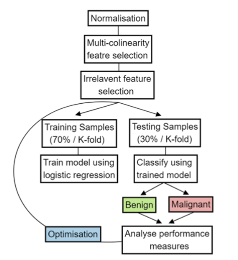

# Classifier for breast tumor

Correct diagnosis of benign or malignant tumours is crucial in saving money, time and especially lives; thereby at the centre of interest of everyone. At present, machine learning algorithms have been utilised to do this with minimal intrusiveness (e.g., fine needle method) while also achieving a high performance accuracy and accurate diagnostic capabilities compared to a physician analysing the data. In this paper, we present a logistic regression binary classifier built based on key breast cancer biomarkers. Our results show that our model correctly classifies tumour cells with the accuracy of 81\%, alongside a recall score of 70\% (i.e., Type II error rate). Additionally, we implement a variety of optimisation techniques such as k-fold cross validation and two distinct feature selection methods to improve our model’s performance. In conclusion, our model performed with adequate (i.e., not optimal) accuracy and recall, which are especially important when classifying tumour cells. Future works include combining different classification algorithms and exploring different existing techniques of optimisation (e.g., Lasso, electric net) to not only further increase accuracy but also recall score.  

# Schematic design for breast cancer classifier

